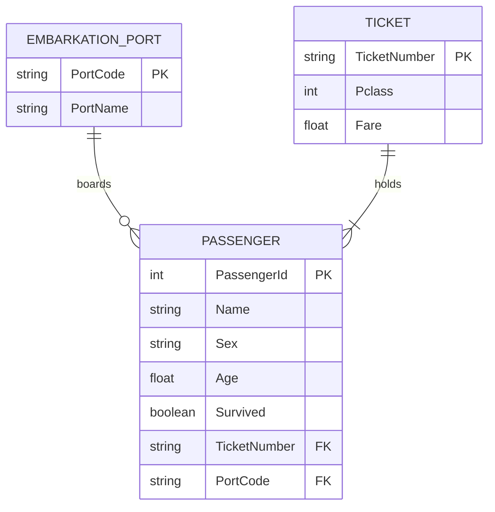

# Actividad Calificable · Corte 2 — Modelo, consulta y limpieza de datos

## 1. ERD (Entity-Relationship Diagram)

El modelo entidad-relación representa la información de los pasajeros del Titanic mediante tres entidades: `PASSENGER`, `TICKET` y `EMBARKATION_PORT`. Cada entidad contiene atributos que permiten organizar los datos y establecer relaciones entre los pasajeros, sus tiquetes y sus puertos de embarque.



### Entidades y atributos

| Entidad          | Atributo          | Descripción                                    |
| ---------------- | ----------------- | ---------------------------------------------- |
| PASSENGER        | PassengerId (PK)  | Identificador único del pasajero.              |
| PASSENGER        | Name              | Nombre completo del pasajero.                  |
| PASSENGER        | Sex               | Sexo registrado del pasajero.                  |
| PASSENGER        | Age               | Edad del pasajero.                             |
| PASSENGER        | Survived          | Indica si sobrevivió: verdadero o falso.       |
| PASSENGER        | TicketNumber (FK) | Número del tiquete asociado al pasajero.       |
| PASSENGER        | PortCode (FK)     | Código del puerto de embarque.                 |
| TICKET           | TicketNumber (PK) | Identificador del tiquete.                     |
| TICKET           | Pclass            | Clase del tiquete: primera, segunda o tercera. |
| TICKET           | Fare              | Tarifa registrada para el tiquete.             |
| EMBARKATION_PORT | PortCode (PK)     | Código del puerto de embarque.                 |
| EMBARKATION_PORT | PortName          | Nombre del puerto de embarque.                 |

### Relaciones y cardinalidades

* **EMBARKATION_PORT — PASSENGER (1:N):** un puerto puede estar relacionado con varios pasajeros. Cada pasajero tiene asociado un puerto de embarque en este modelo.
* **TICKET — PASSENGER (1:N):** un número de tiquete puede estar asociado con uno o varios pasajeros. Cada pasajero se relaciona con un tiquete.

Las claves primarias identifican de forma única cada registro de las entidades, mientras que las claves foráneas permiten relacionarlas entre sí.

## 2. Código en Python: carga, limpieza y consultas

Se utiliza Python con la biblioteca pandas para cargar el conjunto de datos del Titanic desde un archivo CSV público. El proceso incluye la inspección inicial, el tratamiento de valores nulos, la eliminación de duplicados, la corrección de tipos de datos, la normalización de formatos y la ejecución de dos consultas.

### Código completo

```python
import pandas as pd

# --------------------------------------------------
# 1. CARGA DEL CONJUNTO DE DATOS
# --------------------------------------------------

url = "https://raw.githubusercontent.com/datasciencedojo/datasets/master/titanic.csv"

df = pd.read_csv(url)

print("========== CARGA INICIAL ==========")
print("Número de filas:", len(df))
print("Número de columnas:", len(df.columns))
print("\nPrimeros cinco registros:")
print(df.head())

# --------------------------------------------------
# 2. DIAGNÓSTICO ANTES DE LA LIMPIEZA
# --------------------------------------------------

print("\n========== ANTES DE LA LIMPIEZA ==========")

nulos_antes = df.isnull().sum()
duplicados_antes = df.duplicated().sum()
filas_antes = len(df)
columnas_antes = len(df.columns)

print("\nValores nulos por columna:")
print(nulos_antes)

print("\nTotal de valores nulos:", int(nulos_antes.sum()))
print("Registros duplicados:", duplicados_antes)
print("Número de filas:", filas_antes)
print("Número de columnas:", columnas_antes)

# --------------------------------------------------
# 3. LIMPIEZA DE DATOS
# --------------------------------------------------

# 3.1. Eliminar registros completamente duplicados
df = df.drop_duplicates()

# 3.2. Imputar edades faltantes con la mediana
mediana_edad = df["Age"].median()
df["Age"] = df["Age"].fillna(mediana_edad)

# 3.3. Eliminar Cabin porque contiene muchos valores nulos
df = df.drop(columns=["Cabin"])

# 3.4. Eliminar filas sin puerto de embarque
df = df.dropna(subset=["Embarked"])

# 3.5. Corregir los tipos de datos
df["PassengerId"] = df["PassengerId"].astype(int)
df["Survived"] = df["Survived"].astype(bool)
df["Pclass"] = df["Pclass"].astype(str)

# 3.6. Normalizar formatos de texto
df["Name"] = df["Name"].str.strip().str.upper()
df["Sex"] = df["Sex"].str.strip().str.lower()
df["Ticket"] = df["Ticket"].str.strip()
df["Embarked"] = df["Embarked"].str.strip().str.upper()

# --------------------------------------------------
# 4. DIAGNÓSTICO DESPUÉS DE LA LIMPIEZA
# --------------------------------------------------

print("\n========== DESPUÉS DE LA LIMPIEZA ==========")

nulos_despues = df.isnull().sum()
duplicados_despues = df.duplicated().sum()

print("\nValores nulos por columna:")
print(nulos_despues)

print("\nTotal de valores nulos:", int(nulos_despues.sum()))
print("Registros duplicados:", duplicados_despues)
print("Número de filas:", len(df))
print("Número de columnas:", len(df.columns))

print("\nTipos de datos finales:")
print(df.dtypes)

# --------------------------------------------------
# 5. COMPARACIÓN ANTES Y DESPUÉS
# --------------------------------------------------

comparacion = pd.DataFrame({
    "Indicador": [
        "Número de filas",
        "Número de columnas",
        "Total de valores nulos",
        "Registros duplicados"
    ],
    "Antes de la limpieza": [
        filas_antes,
        columnas_antes,
        int(nulos_antes.sum()),
        int(duplicados_antes)
    ],
    "Después de la limpieza": [
        len(df),
        len(df.columns),
        int(nulos_despues.sum()),
        int(duplicados_despues)
    ]
})

print("\n========== COMPARACIÓN DE LIMPIEZA ==========")
print(comparacion.to_string(index=False))

# --------------------------------------------------
# 6. CONSULTA 1
# --------------------------------------------------
# Pregunta:
# ¿Cuál fue la tarifa promedio de los pasajeros
# de tercera clase según su supervivencia?

print("\n========== CONSULTA 1 ==========")

tercera_clase = df[df["Pclass"] == "3"]

consulta_1 = (
    tercera_clase
    .groupby("Survived")["Fare"]
    .mean()
    .reset_index(name="Tarifa_promedio")
)

consulta_1["Resultado"] = consulta_1["Survived"].map({
    False: "No sobrevivió",
    True: "Sobrevivió"
})

print(consulta_1[["Resultado", "Tarifa_promedio"]].to_string(index=False))

for _, fila in consulta_1.iterrows():
    print(
        f"{fila['Resultado']}: tarifa promedio = "
        f"{fila['Tarifa_promedio']:.2f}"
    )

# --------------------------------------------------
# 7. CONSULTA 2
# --------------------------------------------------
# Pregunta:
# ¿Cuál fue la tasa de supervivencia de los menores
# de 18 años según el sexo registrado?

print("\n========== CONSULTA 2 ==========")

menores = df[df["Age"] < 18].copy()

consulta_2 = (
    menores
    .groupby("Sex")["Survived"]
    .mean()
    .reset_index(name="Tasa_supervivencia")
)

consulta_2["Porcentaje_supervivencia"] = (
    consulta_2["Tasa_supervivencia"] * 100
)

print(
    consulta_2[
        ["Sex", "Porcentaje_supervivencia"]
    ].to_string(index=False)
)

for _, fila in consulta_2.iterrows():
    print(
        f"{fila['Sex']}: "
        f"{fila['Porcentaje_supervivencia']:.2f}% de supervivencia"
    )

# --------------------------------------------------
# 8. CONCLUSIÓN AUTOMÁTICA DE LAS CONSULTAS
# --------------------------------------------------

print("\n========== RESUMEN DE HALLAZGOS ==========")

print(
    "La primera consulta compara las tarifas promedio "
    "de los pasajeros de tercera clase según su supervivencia."
)

print(
    "La segunda consulta compara las tasas de supervivencia "
    "de los menores de 18 años según el sexo registrado."
)

print(
    "Los valores numéricos obtenidos se muestran en las "
    "tablas y en los resultados anteriores."
)
```

### Procedimiento de limpieza aplicado

| Operación                 | Procedimiento realizado                                            | Justificación                                                    |
| ------------------------- | ------------------------------------------------------------------ | ---------------------------------------------------------------- |
| Conteo de nulos           | Se utiliza `isnull().sum()`.                                       | Identificar los campos con información faltante.                 |
| Eliminación de duplicados | Se utiliza `drop_duplicates()`.                                    | Evitar registros completamente repetidos.                        |
| Imputación de edades      | Los valores faltantes de `Age` se reemplazan por la mediana.       | Conservar los registros que no tienen edad registrada.           |
| Eliminación de columna    | Se elimina `Cabin`.                                                | La columna contiene una proporción elevada de valores faltantes. |
| Eliminación de filas      | Se eliminan filas sin valor en `Embarked`.                         | Evitar valores faltantes en el puerto de embarque.               |
| Corrección de tipos       | Se ajustan los tipos de `PassengerId`, `Survived` y `Pclass`.      | Facilitar la interpretación y el procesamiento de los datos.     |
| Normalización             | Se eliminan espacios innecesarios y se unifican formatos de texto. | Mejorar la consistencia de los registros.                        |
| Verificación final        | Se vuelven a contar nulos, duplicados, filas y columnas.           | Comprobar los cambios realizados.                                |

### Resultados antes y después de la limpieza

El siguiente cuadro resume los resultados esperados al utilizar la versión estándar del archivo CSV enlazado. El código anterior calcula nuevamente todos los valores para verificar el resultado de la ejecución.

| Indicador                          | Antes de la limpieza | Después de la limpieza |
| ---------------------------------- | -------------------: | ---------------------: |
| Filas                              |                  891 |                    889 |
| Columnas                           |                   12 |                     11 |
| Valores nulos                      |                  866 |                      0 |
| Registros completamente duplicados |                    0 |                      0 |

**Interpretación:** inicialmente, las columnas `Age`, `Cabin` y `Embarked` contienen los principales valores faltantes. La edad se completa con la mediana, se elimina la columna `Cabin` y se retiran las dos filas sin puerto de embarque. Por esta razón, el conjunto final conserva 889 filas y tiene una columna menos. Los resultados deben contrastarse con la salida del código antes de entregar.

## 3. Consultas y hallazgos

### Consulta 1. Tarifa promedio de los pasajeros de tercera clase

**Pregunta:** ¿Cuál fue la tarifa promedio de los pasajeros de tercera clase según su supervivencia?

**Filtro:** se seleccionan los pasajeros cuyo valor de `Pclass` es `"3"`.

**Agregación:** se calcula el promedio de `Fare`, agrupando los registros según el valor de `Survived`.

**Hallazgo:** la consulta permite comparar las tarifas promedio registradas para los pasajeros de tercera clase que sobrevivieron y los que no sobrevivieron. La diferencia entre ambos promedios se debe establecer a partir de los resultados impresos por el programa, sin asumir que una tarifa más alta haya causado la supervivencia.

### Consulta 2. Supervivencia de los menores de 18 años

**Pregunta:** ¿Cuál fue la tasa de supervivencia de los menores de 18 años según el sexo registrado?

**Filtro:** se seleccionan los pasajeros cuya edad es inferior a 18 años.

**Agregación:** se calcula el promedio de la variable `Survived` para cada grupo de la columna `Sex`. Como esta variable se convierte a valores booleanos, su promedio corresponde a la proporción de pasajeros que sobrevivieron.

**Hallazgo:** la consulta permite comparar el porcentaje de supervivencia de los menores de 18 años según el sexo registrado. Los porcentajes exactos se obtienen al ejecutar el código. Estos resultados describen los registros analizados y no demuestran por sí solos una relación causal.

## 4. Data & cleaning

The dataset used in this analysis contains information about passengers aboard the Titanic, including their names, ages, sex, ticket classes, fares, embarkation ports, and survival status. The CSV file was obtained from the public Data Science Dojo GitHub repository. The initial data inspection counted missing values and duplicate records in each column and across the dataset. Duplicate rows were removed, missing ages were replaced with the median age, and the `Cabin` column was dropped because it contained many missing values. Rows without an embarkation port were also removed to prevent missing values in that field. Data types were corrected, and text fields were normalized by removing unnecessary spaces and standardizing letter case. The first question compared the average fares of third-class passengers according to their survival status. The second question compared survival rates among passengers younger than eighteen according to their recorded sex. The results were calculated using pandas and printed to allow the data cleaning process and both queries to be checked.

## Referencias

1. Data Science Dojo. (s. f.). *Titanic dataset* [Archivo CSV]. GitHub. https://github.com/datasciencedojo/datasets/blob/master/titanic.csv

2. Kaggle. (s. f.). *Titanic: Machine Learning from Disaster*. https://www.kaggle.com/competitions/titanic

3. pandas development team. (s. f.). *pandas documentation*. https://pandas.pydata.org/docs/

4. pandas development team. (s. f.). *pandas.DataFrame.drop_duplicates*. https://pandas.pydata.org/docs/reference/api/pandas.DataFrame.drop_duplicates.html

5. pandas development team. (s. f.). *pandas.DataFrame.dropna*. https://pandas.pydata.org/docs/reference/api/pandas.DataFrame.dropna.html
